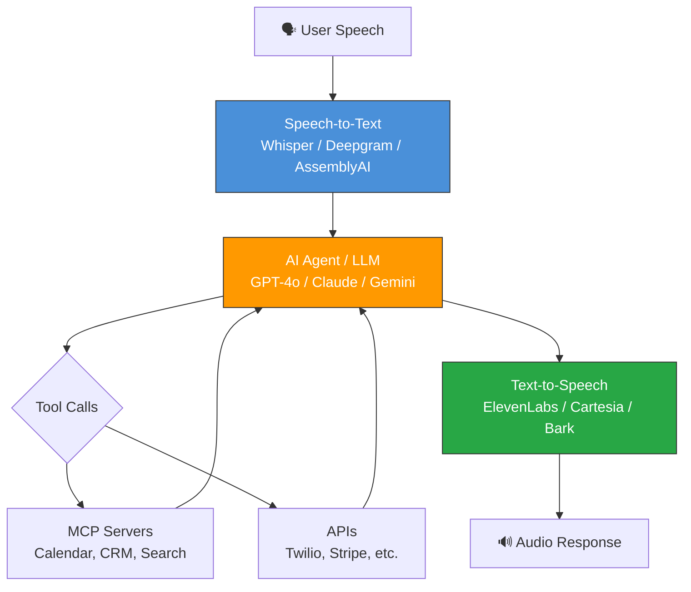
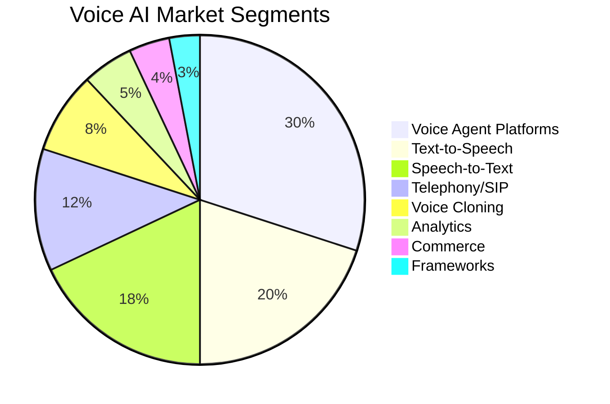

  

  
  
  
  
  

  <strong>A curated list of voice AI tools, frameworks, platforms, and models.</strong> 
  <em>Voice agents, text-to-speech, speech-to-text, voice cloning, telephony, and more.</em>

  <a href="#voice-agent-platforms">Voice Agents</a> · <a href="#text-to-speech">TTS</a> · <a href="#speech-to-text">STT</a> · <a href="#voice-cloning">Cloning</a> · <a href="#frameworks">Frameworks</a> · <a href="#telephony-infrastructure">Telephony</a> · <a href="CONTRIBUTING.md">Contribute</a>

---

## Why This List Exists

Voice AI is the fastest-growing segment of the AI stack in 2026. The global Voice Chat API market is projected to reach $3.5B by 2033. Platforms like Retell AI, Vapi, ElevenLabs, and LiveKit are processing billions of minutes monthly. Gartner predicts 40% of enterprise apps will feature AI agents by end of 2026.

But there's no single place to discover all the tools. This list fixes that.

---

## Contents

- [Voice Agent Platforms](#voice-agent-platforms) — Build and deploy voice AI agents
- [Text-to-Speech](#text-to-speech) — AI speech synthesis and voice generation
- [Speech-to-Text](#speech-to-text) — Transcription, recognition, and understanding
- [Voice Cloning](#voice-cloning) — Clone and generate custom voices
- [Frameworks & SDKs](#frameworks--sdks) — Open-source voice AI frameworks
- [Telephony Infrastructure](#telephony-infrastructure) — SIP, phone numbers, call routing
- [Voice Analytics](#voice-analytics) — Call analysis, sentiment, and QA
- [Voice Commerce](#voice-commerce) — Voice-activated shopping and payments
- [Voice Platforms & Assistants](#voice-platforms--assistants) — Alexa, Siri, Google ecosystem
- [MCP Servers for Voice](#mcp-servers-for-voice) — Model Context Protocol voice integrations

---

## Voice Agent Platforms

Platforms for building, deploying, and managing AI voice agents.

| Tool | Type | Description | Highlights |
|------|------|-------------|------------|
| **[Retell AI](https://www.retellai.com/)** | Commercial | Developer-friendly voice agent platform with drag-and-drop builder | MCP support, Twilio integration, multilingual, real-time workflows |
| **[Vapi](https://vapi.ai/)** | Commercial | Provider-agnostic voice AI orchestration layer | 62M monthly calls, 14+ providers, $0.05/min, 99.99% SLA |
| **[ElevenLabs Conversational AI](https://elevenlabs.io/)** | Commercial | Voice agent platform with industry-leading voice quality | Sub-100ms latency, 11,000+ voices, 70+ languages |
| **[Bland AI](https://www.bland.ai/)** | Commercial | High-volume outbound voice agent platform | Purpose-built for sales campaigns, enterprise telephony |
| **[LiveKit Agents](https://github.com/livekit/agents)** | Open Source | Real-time voice agent framework with WebRTC | Fully open source, plugin architecture, MCP support |
| **[Synthflow](https://synthflow.ai/)** | Commercial | No-code voice agent builder | White-label, 200+ integrations, appointment booking |
| **[Hermes](https://www.buildwithhermes.com/)** | Commercial | White-label voice agent platform built for agencies | Built-in CRM, campaign orchestration, transparent usage billing, from $149/mo, 80%+ margins per client |
| **[Cognigy](https://www.cognigy.com/)** | Enterprise | Enterprise conversational AI platform | Omnichannel, contact center integration, 100+ languages |
| **[Lindy AI](https://www.lindy.ai/)** | Commercial | AI assistant with voice agent capabilities | Multi-step workflows, triggers, CRM integration |
| **[Air AI](https://www.air.ai/)** | Commercial | Autonomous voice agent for sales and customer service | 40+ minute conversations, calendar booking |
| **[Voiceflow](https://www.voiceflow.com/)** | Commercial | Collaborative voice & chat AI agent builder | Visual builder, team collaboration, multi-channel |
| **[Hamming AI](https://hamming.ai/)** | Commercial | Voice agent testing and evaluation platform | Automated QA, regression testing, performance scoring |
| **[Inworld AI](https://inworld.ai/)** | Commercial | Character-driven voice AI for games and enterprise | Real-time animation, emotional intelligence, gaming SDK |
| **[PlayAI](https://play.ai/)** | Commercial | Voice agent platform with ultra-realistic voices | Sub-200ms latency, voice cloning, custom models |
| **[Thoughtly](https://www.thoughtly.io/)** | Commercial | Enterprise voice agent with human-like conversations | No-code builder, CRM sync, call analytics |

> [Detailed comparison →](categories/voice-agents/)

---

## Text-to-Speech

AI-powered speech synthesis — from real-time voices to studio-quality narration.

### Commercial

| Tool | Latency | Languages | Highlights |
|------|---------|-----------|------------|
| **[ElevenLabs](https://elevenlabs.io/)** | <100ms | 70+ | Industry-leading quality, voice cloning, 11k+ voices |
| **[Play.ht](https://play.ht/)** | <200ms | 60+ | Ultra-realistic, voice cloning, API + widget |
| **[Deepgram Aura](https://deepgram.com/aura)** | <100ms | 10+ | Optimized for voice agents, streaming, low cost |
| **[Amazon Polly](https://aws.amazon.com/polly/)** | <200ms | 30+ | AWS integration, SSML, neural voices |
| **[Google Cloud TTS](https://cloud.google.com/text-to-speech)** | <200ms | 40+ | WaveNet and Neural2 voices, Studio voices |
| **[Azure Speech](https://azure.microsoft.com/en-us/products/ai-services/text-to-speech)** | <200ms | 100+ | Custom Neural Voice, SSML, avatar support |
| **[Resemble AI](https://www.resemble.ai/)** | <200ms | 25+ | Real-time cloning, emotion control, API |
| **[Cartesia](https://cartesia.ai/)** | <80ms | 10+ | Sonic model, ultra-low latency streaming |
| **[Fish Audio](https://fish.audio/)** | <150ms | 10+ | Open-weight models, voice cloning, multilingual |

### Open Source

| Tool | Stars | License | Highlights |
|------|:-----:|---------|------------|
| **[Coqui XTTS](https://github.com/coqui-ai/TTS)** | 36k+ | MPL 2.0 | Voice cloning with 6s sample, multilingual, most downloaded on HF |
| **[Bark](https://github.com/suno-ai/bark)** | 37k+ | MIT | Non-verbal sounds, laughter, music, multi-speaker |
| **[Piper](https://github.com/rhasspy/piper)** | 7k+ | MIT | Lightweight, runs on Raspberry Pi, 20+ languages |
| **[StyleTTS2](https://github.com/yl4579/StyleTTS2)** | 5k+ | MIT | Studio-quality, style diffusion, human-level naturalness |
| **[GPT-SoVITS](https://github.com/RVC-Boss/GPT-SoVITS)** | 40k+ | MIT | 1-min voice data training, few-shot cloning |
| **[OpenVoice](https://github.com/myshell-ai/OpenVoice)** | 30k+ | MIT | Instant voice cloning, emotion/accent control |
| **[MeloTTS](https://github.com/myshell-ai/MeloTTS)** | 5k+ | MIT | High-quality multi-language, real-time CPU inference |
| **[Parler-TTS](https://github.com/huggingface/parler-tts)** | 4k+ | Apache 2.0 | Text-described voice control, Hugging Face native |
| **[MetaVoice](https://github.com/metavoiceio/metavoice-src)** | 3k+ | Apache 2.0 | Finetuning in 1 minute, emotional speech |
| **[OpenEdAI Speech](https://github.com/matatonic/openedai-speech)** | 2k+ | AGPL | OpenAI API-compatible TTS server, drop-in replacement |
| **[AllTalk TTS](https://github.com/erew123/alltalk_tts)** | 2k+ | AGPL | Multi-engine TTS server, text-generation-webui support |

> [Full TTS comparison →](categories/text-to-speech/)

---

## Speech-to-Text

Transcription, real-time recognition, and audio understanding.

### Commercial APIs

| Tool | WER | Languages | Highlights |
|------|-----|-----------|------------|
| **[Deepgram Nova-3](https://deepgram.com/)** | <8% | 40+ | Fastest streaming, $0.0043/min, voice agent optimized |
| **[AssemblyAI (Slam-1)](https://www.assemblyai.com/)** | <10% | 20+ | Speaker diarization, sentiment, content moderation |
| **[Gladia](https://www.gladia.io/)** | <10% | 100+ | Real-time code-switching, zero-shot language detection |
| **[Speechmatics](https://www.speechmatics.com/)** | <10% | 50+ | On-prem option, real-time, batch, translation |
| **[Rev AI](https://www.rev.ai/)** | <5% | 30+ | Human-verified option, 99% accuracy, legal/medical |
| **[Google Cloud STT](https://cloud.google.com/speech-to-text)** | <12% | 125+ | Chirp model, medical dictation, streaming |
| **[Azure Speech](https://azure.microsoft.com/en-us/products/ai-services/speech-to-text)** | <10% | 100+ | Custom speech models, real-time, batch |
| **[Amazon Transcribe](https://aws.amazon.com/transcribe/)** | <12% | 100+ | Medical, call analytics, volume discounts to 67% |

### Open Source

| Tool | Stars | License | Highlights |
|------|:-----:|---------|------------|
| **[Whisper](https://github.com/openai/whisper)** | 75k+ | MIT | The standard, 99+ languages, robust in noise |
| **[Faster-Whisper](https://github.com/SYSTRAN/faster-whisper)** | 13k+ | MIT | 4x faster than Whisper, CTranslate2 backend |
| **[Whisper.cpp](https://github.com/ggerganov/whisper.cpp)** | 37k+ | MIT | C/C++ port, runs on CPU/phone/RPi, WASM support |
| **[Vosk](https://github.com/alphacep/vosk-api)** | 8k+ | Apache 2.0 | Offline, lightweight, mobile/embedded, 20+ languages |
| **[NeMo (NVIDIA)](https://github.com/NVIDIA/NeMo)** | 12k+ | Apache 2.0 | Enterprise-grade, Conformer/Canary models, GPU optimized |
| **[Whisper-Streaming](https://github.com/ufal/whisper_streaming)** | 2k+ | MIT | Real-time streaming Whisper with local agreement |
| **[Insanely-Fast-Whisper](https://github.com/Vaibhavs10/insanely-fast-whisper)** | 7k+ | MIT | 150x faster with speculative decoding + batching |

> [Full STT comparison →](categories/speech-to-text/)

---

## Voice Cloning

Clone voices from short audio samples for custom TTS.

| Tool | Stars | Type | Highlights |
|------|:-----:|------|------------|
| **[GPT-SoVITS](https://github.com/RVC-Boss/GPT-SoVITS)** | 40k+ | Open Source | 1-min data training, few-shot, singing + speech |
| **[OpenVoice](https://github.com/myshell-ai/OpenVoice)** | 30k+ | Open Source | Instant cloning, tone/emotion/accent control |
| **[RVC (Retrieval-based VC)](https://github.com/RVC-Project/Retrieval-based-Voice-Conversion-WebUI)** | 25k+ | Open Source | Real-time conversion, music community favorite |
| **[Coqui XTTS](https://github.com/coqui-ai/TTS)** | 36k+ | Open Source | 6-second sample cloning, 17 languages |
| **[Bark Voice Clone](https://github.com/serp-ai/bark-with-voice-clone)** | 3k+ | Open Source | Bark + voice cloning, easy speaker prompts |
| **[ElevenLabs](https://elevenlabs.io/)** | — | Commercial | Professional voice cloning, 29 languages |
| **[Resemble AI](https://www.resemble.ai/)** | — | Commercial | Real-time cloning, emotion control, watermarking |
| **[Play.ht](https://play.ht/)** | — | Commercial | Instant cloning, cross-lingual, API access |

> [Full voice cloning comparison →](categories/voice-cloning/)

---

## Frameworks & SDKs

Open-source frameworks for building voice AI applications.

| Framework | Stars | Language | Description |
|-----------|:-----:|----------|-------------|
| **[Pipecat](https://github.com/pipecat-ai/pipecat)** | 8k+ | Python | Voice + multimodal conversational AI by Daily. STT→LLM→TTS pipelines |
| **[LiveKit Agents](https://github.com/livekit/agents)** | 5k+ | Python | Real-time voice agents with WebRTC, MCP support, plugin architecture |
| **[Vocode](https://github.com/vocodedev/vocode-core)** | 3k+ | Python | Low-level modular voice agent toolkit, telephony integration |
| **[Bolna](https://github.com/bolna-ai/bolna)** | 2k+ | Python | Production voice agents with <1s latency, Twilio/Plivo ready |
| **[OpenAI Realtime API](https://platform.openai.com/docs/guides/realtime)** | — | Multi | Native multimodal streaming, voice-to-voice, function calling |
| **[Nimble Pipecat](https://github.com/daily-co/nimble-pipecat)** | 500+ | Python | Lightweight voice agent framework by Daily |
| **[NVIDIA Voice Agent](https://github.com/NVIDIA/voice-agent-examples)** | 500+ | Python | Pipecat-based examples for real-time voice agents |
| **[MCP Voice Assistant](https://github.com/mcp-use/mcp-use-voice-assistant)** | 300+ | Python | Voice assistant powered by MCP, Whisper + ElevenLabs |

> [Full framework comparison →](categories/frameworks/)

---

## Telephony Infrastructure

SIP trunking, phone numbers, and call routing for voice AI agents.

| Provider | Type | Highlights |
|----------|------|------------|
| **[Twilio](https://www.twilio.com/voice)** | Commercial | Largest ecosystem, best docs, global coverage, $0.013/min |
| **[Telnyx](https://telnyx.com/)** | Commercial | Private IP network, lowest latency, owns infrastructure |
| **[Plivo](https://www.plivo.com/)** | Commercial | Single-stack (owns telco + AI), 99.99% uptime, HIPAA |
| **[Vonage](https://www.vonage.com/)** | Commercial | Enterprise-grade, video + voice, conversation API |
| **[SignalWire](https://signalwire.com/)** | Commercial | FreeSWITCH creators, AI-native, programmable telco |
| **[Bandwidth](https://www.bandwidth.com/)** | Commercial | Direct carrier, 911/E911, enterprise focus |

> [Full telephony comparison →](categories/telephony/)

---

## Voice Analytics

Call analysis, conversation intelligence, and quality assurance.

| Tool | Type | Description |
|------|------|-------------|
| **[Gong](https://www.gong.io/)** | Commercial | Revenue intelligence, call recording, deal insights |
| **[Chorus.ai](https://www.chorus.ai/)** | Commercial | Conversation intelligence for sales teams (ZoomInfo) |
| **[Observe.AI](https://www.observe.ai/)** | Commercial | Contact center AI, real-time agent assist, QA automation |
| **[Callrail](https://www.callrail.com/)** | Commercial | Call tracking, conversation analytics, lead attribution |
| **[Symbl.ai](https://symbl.ai/)** | Commercial | Real-time conversation intelligence API, sentiment, topics |
| **[Hamming AI](https://hamming.ai/)** | Commercial | Voice agent testing platform, automated regression testing |

> [Full analytics comparison →](categories/voice-analytics/)

---

## Voice Commerce

Voice-activated shopping, ordering, and payments.

| Tool | Type | Description |
|------|------|-------------|
| **[Amazon Alexa Shopping](https://developer.amazon.com/)** | Platform | Voice ordering through Alexa ecosystem |
| **[Google Shopping Actions](https://shopping.google.com/)** | Platform | Voice commerce through Google Assistant |
| **[Ringly.io](https://www.ringly.io/)** | Commercial | AI phone agent for e-commerce, abandoned cart recovery |
| **[PolyAI](https://poly.ai/)** | Commercial | Enterprise voice assistants for ordering and booking |
| **[SoundHound](https://www.soundhound.com/)** | Commercial | Voice AI for restaurants, automotive, hospitality |

> [Full voice commerce comparison →](categories/voice-commerce/)

---

## Voice Platforms & Assistants

Major voice assistant ecosystems and their developer tools.

| Platform | Type | Developer Resources |
|----------|------|---------------------|
| **[Amazon Alexa](https://developer.amazon.com/alexa)** | Platform | Skills Kit, Voice Service, Smart Home API |
| **[Google Assistant](https://developers.google.com/assistant)** | Platform | Actions, Conversational Actions, Home APIs |
| **[Apple Siri / SiriKit](https://developer.apple.com/siri/)** | Platform | Intents, Shortcuts, App Intents framework |
| **[Samsung Bixby](https://bixbydevelopers.com/)** | Platform | Capsules, voice actions, SmartThings |
| **[OpenClaw](https://github.com/nicbarker/openclaw)** | Open Source | Personal AI assistant, 50+ integrations, 210k+ stars |
| **[Open WebUI](https://github.com/open-webui/open-webui)** | Open Source | Self-hosted AI with voice, 124k+ stars, offline capable |
| **[Home Assistant Voice](https://www.home-assistant.io/voice_control/)** | Open Source | Privacy-focused voice control for smart home |

> [Full platform comparison →](categories/voice-platforms/)

---

## MCP Servers for Voice

Model Context Protocol (MCP) servers relevant to voice AI applications.

| Server | Description | Voice Use Case |
|--------|-------------|----------------|
| **[Retell AI MCP](https://github.com/nichochar/retell-mcp-server)** | Manage Retell AI voice agents via MCP | Build and deploy voice agents from any MCP client |
| **[ElevenLabs MCP](https://github.com/elevenlabs/elevenlabs-mcp)** | Text-to-speech and voice cloning via MCP | Generate speech from any AI assistant |
| **[Voice Call MCP](https://github.com/popcornspace/voice-call-mcp-server)** | Initiate voice calls via Twilio + OpenAI | AI-initiated phone calls |
| **[Whisper MCP](https://github.com/nichochar/brave-search-mcp)** | Speech-to-text transcription via MCP | Voice input for any MCP client |
| **[Home Assistant MCP](https://github.com/homeassistant-ai/ha-mcp)** | Smart home control via MCP | Voice-controlled smart home |
| **[Spotify MCP](https://github.com/marcelmarais/spotify-mcp-server)** | Music playback and search via MCP | "Play my playlist" from any voice agent |

> See **[Alexa-MCPs](https://github.com/ALLBOTSIO/Alexa-MCPs)** for the full 200-server directory of MCP servers optimized for voice assistants.

---

## How Voice AI Architecture Works

---

## Market Landscape (2026)

---

## Contributing

See [CONTRIBUTING.md](CONTRIBUTING.md) for guidelines. TL;DR:

1. Fork → Add tool to appropriate section → Submit PR
2. Or [open an issue](https://github.com/ALLBOTSIO/awesome-voice-ai/issues/new?template=submit-tool.yml) to suggest a tool

### Criteria

- Must be a real, working product or actively maintained open-source project
- Must be relevant to voice AI (not general AI/ML)
- Include a brief, factual description — no marketing copy

---

## Star History

If this list helps you, star it so others can find it too.

<a href="https://star-history.com/#ALLBOTSIO/awesome-voice-ai&Date">
  <picture>
    <source media="(prefers-color-scheme: dark)" srcset="https://api.star-history.com/svg?repos=ALLBOTSIO/awesome-voice-ai&type=Date&theme=dark" />
    
  </picture>
</a>

---

## Related Lists

- **[Alexa-MCPs](https://github.com/ALLBOTSIO/Alexa-MCPs)** — 200 MCP servers for voice assistants
- **[awesome-mcp-servers](https://github.com/wong2/awesome-mcp-servers)** — 84k+ star MCP directory
- **[awesome-ai-agents-2026](https://github.com/caramaschiHG/awesome-ai-agents-2026)** — 300+ AI agent resources

---

## License

[MIT](LICENSE) — AI Venture Holdings LLC

  Built by <a href="https://allbots.io">ALLBOTS.io</a> · A portfolio company of <strong>AI Venture Holdings LLC</strong> 
  ⭐ Star this repo to stay updated as new voice AI tools launch

